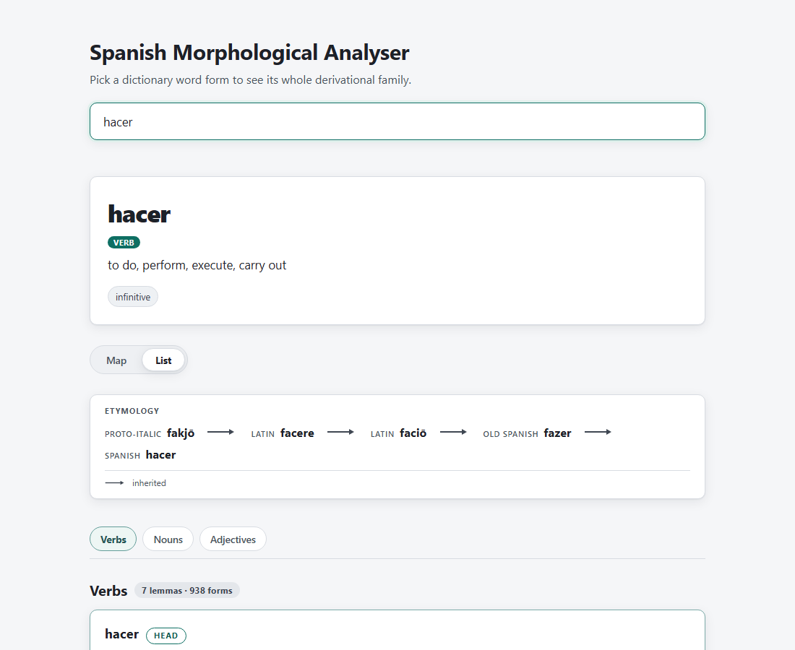
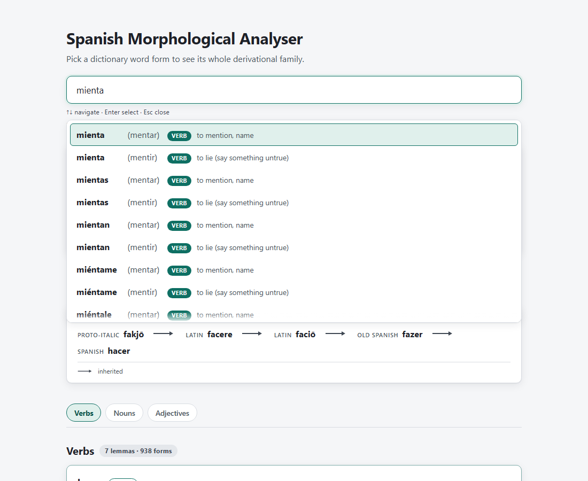
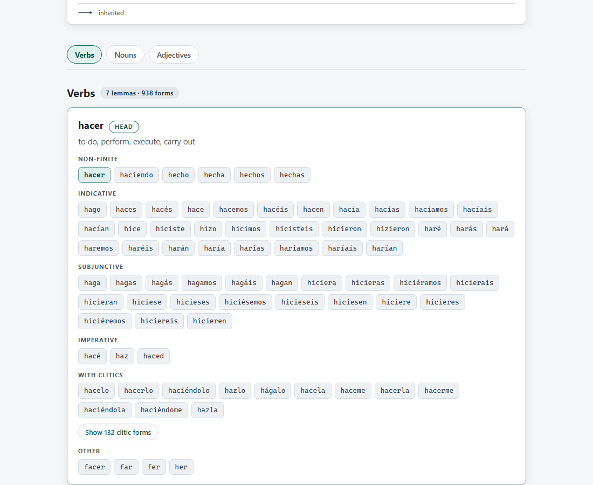

# Spanish Morphological Analyser

A web app for exploring Spanish morphology: type into a search box and pick a
dictionary **word form** from the dropdown (there is no free-text submit —
analysis is only ever triggered by selecting a concrete form). The analysis
view shows the selected form's whole morphological/derivational family, grouped
by part of speech, with each member lemma's paradigm rendered in labelled
sections (Non-finite / Indicative / Subjunctive / Imperative / With clitics).

## Screenshots







## What it does

- **Search-by-form dropdown.** Matching is case- and accent-insensitive and
  tiered: exact form match, then prefix, then (only when the prefix finds
  nothing) substring. Within a tier, results sort by corpus frequency
  descending (multi-word entries carry no frequency and sort last), then by
  length, then alphabetically. Rows for the same surface form under
  different lemmas stay adjacent and are disambiguated with a parenthesised
  lemma qualifier — omitted when it would only repeat the surface form, the
  POS chip and gloss already distinguishing those rows — plus the POS chip
  and the gloss, so `hizo` finds `hizo`, and `mienta` shows both
  `mienta (mentir)` and `mienta (mentar)`.
- **Family analysis.** Each entry resolves to its family: a head lemma, a
  cutoff note when the family has one (explaining why membership ends where
  it does), and groups ordered Verbs → Nouns → Adjectives → Adverbs →
  everything else. Members show a relation chip (`des- + hacer`,
  `inherited from Latin facticius`, `same paradigm as hacer`, …), and their
  forms render as a dense chip grid bucketed into paradigm sections; long
  lists collapse with "show all" toggles.
- **Etymology & family map.** Three new layers show *how a word came to be*
  (built from the `etymon`/`derivation` tables the pipeline persists — the
  family membership cutoff itself is unchanged):
  - a **derivation map** of the family — the head at the root, every other
    member hanging off its derivational parent (`hacer → hacedor`,
    `hacer → deshacer → deshecho`), hover a node to see the path from the
    head;
  - an **ancestry ribbon** — the word's own ancestor chain from the source,
    macrons preserved (`objetar < Latin obiectāre`, `echar < Late Latin
    iectāre < Latin iactāre`), capped at 8 links with at most one
    proto-language row;
  - a **cousins strip** — other words sharing the deepest usable non-proto
    etymon but outside the family, reached by exact etymon or by the
    prefix-stripped root (`objetar` and `proyectar` both strip to
    `iectāre`), capped at 60 descendants per shared etymon. Family members
    are never offered as cousins.
  See `scripts/screenshots/30-map-hacer.png` (map), `32-ancestry-ribbon.png`
  (ribbon) and `33-cousins.png` (cousins) for the real-data rendering.
  Coverage is data-bound: about a third of lemmas have any parsed ancestry
  at all, so roughly two thirds of words show no ribbon and no cousins
  strip — that is the source's coverage, not a bug.
- **Backends.** The store is a thin dispatcher (`app/store.py`) with two
  implementations exposing the same contract: a hand-authored JSON fixture
  (`app/store_fixture.py`) and the real SQLite store (`app/store_sqlite.py`),
  selected via `MORPH_BACKEND`.

## Source data

The two source datasets are **not** committed to this repository — download
them and place them at the repo root:

- `kaikki.org-dictionary-Spanish.jsonl` — the Spanish extraction from
  <https://kaikki.org/dictionary/Spanish/> (wiktextract output of English
  Wiktionary), ~980 MB
- `es_full.txt` — the Spanish word-frequency list from
  <https://github.com/hermitdave/FrequencyWords>
  (`content/2018/es/es_full.txt`, OpenSubtitles-derived), ~14.5 MB

Running `python -m pipeline.build` then produces `data/morph.sqlite`
(~300 MB, ~2 minutes). Until that build has been run, the app falls back to
the bundled JSON fixture.

## Prerequisites

- Python 3.11+ (developed on 3.13).
- The two source datasets at the repo root — see [Source data](#source-data) below.
- Windows: `py -3` is used below; on other platforms substitute `python3`.

## Setup

```
py -3 -m venv .venv
.venv\Scripts\python -m pip install --upgrade pip
.venv\Scripts\python -m pip install -r requirements.txt
```

`requirements.txt` covers everything needed to run the app and build the
database. Contributors running the test suite or the UI smoke test install
the dev requirements on top of it instead:

```
.venv\Scripts\python -m pip install -r requirements-dev.txt
.venv\Scripts\python -m playwright install chromium   # UI smoke test only
```

## Build the database

The real store reads `data/morph.sqlite` (~300 MB, produced from the source
files above; ~2 minutes):

```
.venv\Scripts\python -m pipeline.build
```

This touches `data/` only (the JSONL intermediates and the SQLite database).
Until it has been run (and while developing), the app falls back to the JSON
fixture.

## Verify

```
.venv\Scripts\python scripts/acceptance.py
```

Runs the read-only acceptance harness (schema/integrity, ambiguity, the hacer
family, non-lemma searchability, family sanity, frequency sanity, API
round-trip). It should report 36 passed, 1 failed — the single failure is a
word genuinely absent from the source dictionary.

## Run

```
.venv\Scripts\python -m uvicorn app.main:app --port 8000
```

Open <http://localhost:8000/>. The backend is chosen by the `MORPH_BACKEND`
environment variable:

- `auto` (default) — use the SQLite store when `data/morph.sqlite` exists and
  `app/store_sqlite.py` imports cleanly, else the fixture
- `sqlite` — always the SQLite store (fails loudly if unavailable)
- `fixture` — always the JSON fixture (the test suite forces this)

API endpoints:

- `GET /api/search?q=<partial>&limit=<n>` — word-form candidates
- `GET /api/analyze?id=<id>` — family analysis for one entry
- `GET /api/health` — status + entry/lemma/family counts + active backend

## Tests

```
.venv\Scripts\python -m pytest
```

`tests/test_api.py` covers the API contract against the fixture backend
(`MORPH_BACKEND=fixture` is forced by `tests/conftest.py` so the suite is
hermetic); `tests/test_store_sqlite.py` builds a small temporary database with
the exact production schema and tests ranking tiers, group adjacency, POS
ordering, form ordering, homographs, and error paths without touching the real
300 MB database.

## UI smoke test

```
.venv\Scripts\python scripts/ui_smoke.py                 # fixture backend
MORPH_BACKEND=sqlite .venv\Scripts\python scripts/ui_smoke.py   # real backend
```

Drives the real UI with Playwright (headless Chromium; installed via
`requirements-dev.txt` — run `python -m playwright install chromium` once),
exercises the full flow —
dropdown, keyboard selection, ambiguity, paradigm sections, clitic expansion,
latency — and captures screenshots to `scripts/screenshots/`.

## Layout

```
app/
  main.py            # FastAPI app: mounts static/, defines API routes
  api.py             # route handlers under /api
  store.py           # backend dispatcher (MORPH_BACKEND)
  store_fixture.py   # fixture-backed store (JSON)
  store_sqlite.py    # SQLite store (production data)
  fixtures/sample.json
  static/            # vanilla HTML/CSS/JS frontend, no build step, no CDN
pipeline/            # linguistic data pipeline (builds data/morph.sqlite)
recon/               # pipeline exploration work
scripts/
  acceptance.py      # read-only acceptance harness
  ui_smoke.py        # Playwright UI verification + screenshots
  screenshots/
tests/
  conftest.py, test_api.py, test_pipeline.py, test_store_sqlite.py
```

## Data licensing & attribution

See `docs/LICENSES.md` for the full audit (package licences, verbatim data
terms, and the obligations per distribution scenario). In short:

- Word data derives from English Wiktionary via kaikki.org's wiktextract
  extraction (<https://kaikki.org/dictionary/Spanish/>,
  <https://en.wiktionary.org/>) and is dual-licensed under **CC BY-SA 4.0**
  (since 2023-06-01; previously 3.0) and the **GFDL** — reusers may comply
  with either. kaikki.org states its data is "made available under the same
  licenses as Wiktionary - both CC-BY-SA and GFDL".
- Frequency data comes from **FrequencyWords** (hermitdave/FrequencyWords,
  OpenSubtitles-derived), licensed **CC BY-SA 4.0** ("MIT License for code.
  CC-by-sa-4.0 for content." per the repository). Both datasets are CC BY-SA
  4.0, so the built `data/morph.sqlite` is a single uniformly CC BY-SA 4.0
  derivative and **is distributable** under CC BY-SA 4.0 with attribution
  and share-alike. (SUBTLEX-ESP, the frequency source before 2026-08-12,
  was CC BY-NC-ND 3.0 and blocked distribution — see docs/LICENSES.md.)
- Neither source dataset is shipped in this repository. The bundled fixture
  `app/fixtures/sample.json` is a small hand-curated sample: its glosses are
  abridged from Wiktionary (CC BY-SA 4.0 applies), while its frequency
  figures are hand-invented demo values — **not** the FrequencyWords data
  (mechanically verified: no FrequencyWords value appears in the fixture).
- Anyone rebuilding must obtain both datasets from the sources above under
  their respective terms.

## Licence

- **Code:** MIT, see [`LICENSE`](LICENSE).
- **Dictionary content and the built database:** CC BY-SA 4.0, see
  [`LICENSE-DATA.md`](LICENSE-DATA.md).

The two are deliberately separate: the code is freely licensed, while the
linguistic content derives from CC BY-SA 4.0 sources (Wiktionary,
FrequencyWords) and cannot be relicensed. Full audit:
[`docs/LICENSES.md`](docs/LICENSES.md).
