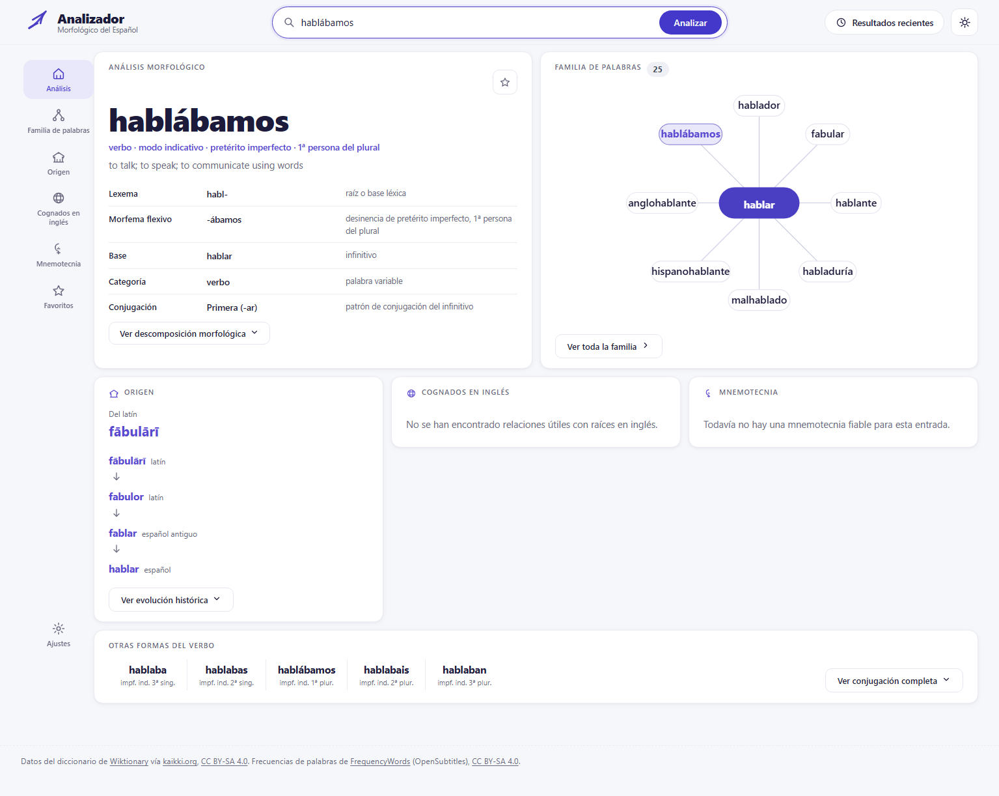
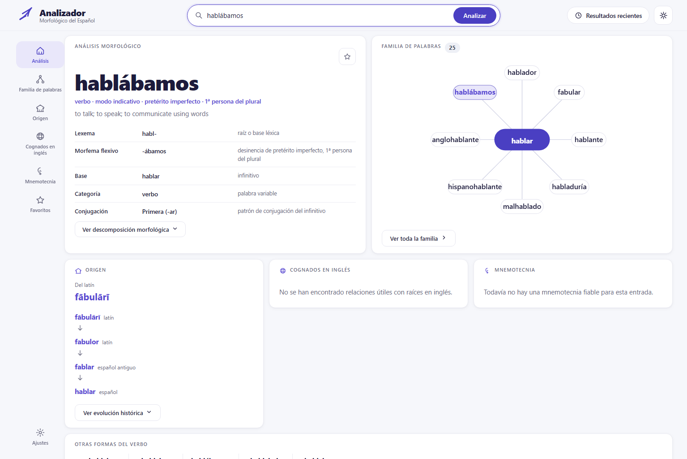
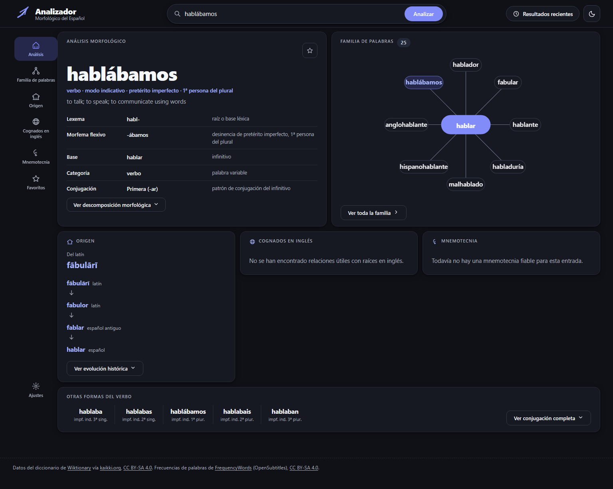
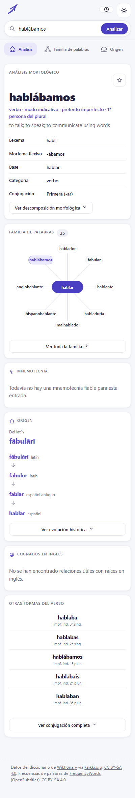

# Analizador Morfológico del Español

A Spanish-language web app for exploring Spanish morphology. Type a word into
the search box: the **combobox dropdown** offers tiered, frequency-ranked
candidates to pick from, and **Enter / Analizar** resolves a typed string to
its top-ranked analysis (exact form match, then citation form; ambiguous
surfaces show the alternatives ranked). The result is a full dashboard — the
product redesign documented in
[`docs/DESIGN_IMPLEMENTATION_PLAN.md`](docs/DESIGN_IMPLEMENTATION_PLAN.md)
(mockup: `design_UI.png`).









## The dashboard — six regions

1. **Análisis morfológico** — the searched form, a Spanish grammatical
   summary (`verbo · modo indicativo · pretérito imperfecto · 1ª persona del
   plural`), the lexeme/morpheme split (`habl-` / `-ábamos`), base, categoría
   and conjugación, a decomposition accordion, and ranked alternative
   analyses for ambiguous forms.
2. **Familia de palabras** — a radial preview: the family head as the hub
   with up to 10 curated satellites (searched form highlighted), a node
   click revealing the derivation relationship, and the real family size
   badge. "Ver toda la familia" opens the full derivation map (Layer 3).
3. **Origen** — the etymology chain with real cited forms, oldest last
   (`hablar → fablar → fabulor → fābulārī`), from the `etymon` table.
4. **Cognados en inglés** — English words sharing a Latin root (Phase 3;
   currently the documented empty state).
5. **Mnemotecnia** — memory aids built from real page relationships
   (Phase 4; currently the documented empty state).
6. **Otras formas del verbo** — the searched form's same-tense paradigm
   strip; "Ver conjugación completa" opens the full POS-grouped paradigm
   view (Layer 3).

Plus: **Resultados recientes** and **Favoritos** (localStorage), a dark-mode
theme toggle, deep links (`/?word=hablábamos`), and a fully keyboard- and
screen-reader-accessible search combobox. The UI is entirely in Spanish, with
no build step, no CDN and no webfonts — offline-capable.

**Honest empty states.** About two thirds of words have no etymology, 59.5%
of lemmas are singleton families, and English cognates, mnemonics and audio
are documented **Phase 2–4 gaps** in the plan (the Spanish-edition import,
the English-edition cognate join, and mnemonic generation). Where data is
absent the cards render the documented empty states rather than invented
content.

## What it does

- **Search-by-form dropdown + free-text resolution.** Matching is case- and
  accent-insensitive and tiered: exact form match, then prefix, then (only
  when the prefix finds nothing) substring. Within a tier, results sort by
  corpus frequency descending (multi-word entries carry no frequency and
  sort last), then by length, then alphabetically. Rows for the same surface
  form under different lemmas stay adjacent and are disambiguated with a
  parenthesised lemma qualifier — omitted when it would only repeat the
  surface form, the POS chip and gloss already distinguishing those rows —
  so `hizo` finds `hizo`, and `mienta` shows both `mienta (mentir)` and
  `mienta (mentar)`. Selecting a dropdown row analyzes that concrete form;
  pressing Enter or Analizar with the dropdown closed resolves the typed
  string to the top-ranked match (with alternatives when ambiguous).
- **Family analysis.** Each entry resolves to its family: a head lemma, a
  cutoff note when the family has one (explaining why membership ends where
  it does), and groups ordered Verbs → Nouns → Adjectives → Adverbs →
  everything else. Members show a relation chip (`des- + hacer`,
  `inherited from Latin facticius`, `same paradigm as hacer`, …), and their
  forms render as a dense chip grid bucketed into paradigm sections; long
  lists collapse with "mostrar" toggles.
- **Etymology & family map.** Three Layer-3 views, opened from the dashboard
  (built from the `etymon`/`derivation` tables the pipeline persists — the
  family membership cutoff itself is unchanged):
  - a **derivation map** of the family — the head at the root, every other
    member hanging off its derivational parent (`hacer → hacedor`,
    `hacer → deshacer → deshecho`), hover a node to see the path from the
    head;
  - an **ancestry ribbon** — the word's own ancestor chain from the source,
    macrons preserved (`objetar < Latin obiectāre`, `echar < Late Latin
    iectāre < Latin iactāre`), capped at 8 links with at most one
    proto-language row;
  - a **cousins strip** — other words sharing the deepest usable non-proto
    etymon but outside the family, reached by exact etymon or by the
    prefix-stripped root (`objetar` and `proyectar` both strip to
    `iectāre`), capped at 60 descendants per shared etymon. Family members
    are never offered as cousins.
  Coverage is data-bound: about a third of lemmas have any parsed ancestry
  at all, so roughly two thirds of words show no ribbon and no cousins
  strip — that is the source's coverage, not a bug.
- **Backends.** The store is a thin dispatcher (`app/store.py`) with two
  implementations exposing the same contract: a hand-authored JSON fixture
  (`app/store_fixture.py`) and the real SQLite store (`app/store_sqlite.py`),
  selected via `MORPH_BACKEND`. The Phase-1 dashboard keys (`morphology`,
  `familyPreview`, `origin`, `nearbyForms`, `englishRelatives`, `mnemonics`,
  `query`) and the `word` parameter are additive and live in both backends —
  the fixture doubles as the empty-state test harness.

## Source data

The two source datasets are **not** committed to this repository — download
them and place them at the repo root:

- `kaikki.org-dictionary-Spanish.jsonl` — the Spanish extraction from
  <https://kaikki.org/dictionary/Spanish/> (wiktextract output of English
  Wiktionary), ~980 MB
- `es_full.txt` — the Spanish word-frequency list from
  <https://github.com/hermitdave/FrequencyWords>
  (`content/2018/es/es_full.txt`, OpenSubtitles-derived), ~14.5 MB

Running `python -m pipeline.build` then produces `data/morph.sqlite`
(~300 MB, ~2 minutes). Until that build has been run, the app falls back to
the bundled JSON fixture.

## Prerequisites

- Python 3.11+ (developed on 3.13).
- The two source datasets at the repo root — see [Source data](#source-data) below.
- Windows: `py -3` is used below; on other platforms substitute `python3`.

## Setup

```
py -3 -m venv .venv
.venv\Scripts\python -m pip install --upgrade pip
.venv\Scripts\python -m pip install -r requirements.txt
```

`requirements.txt` covers everything needed to run the app and build the
database. Contributors running the test suite or the UI smoke test install
the dev requirements on top of it instead:

```
.venv\Scripts\python -m pip install -r requirements-dev.txt
.venv\Scripts\python -m playwright install chromium   # UI smoke test only
```

## Build the database

The real store reads `data/morph.sqlite` (~300 MB, produced from the source
files above; ~2 minutes):

```
.venv\Scripts\python -m pipeline.build
```

This touches `data/` only (the JSONL intermediates and the SQLite database).
Until it has been run (and while developing), the app falls back to the JSON
fixture.

## Verify

```
.venv\Scripts\python scripts/acceptance.py
```

Runs the read-only acceptance harness (schema/integrity, ambiguity, the hacer
family, non-lemma searchability, family sanity, frequency sanity, API
round-trip). It should report 36 passed, 1 failed — the single failure is a
word genuinely absent from the source dictionary.

## Run

```
.venv\Scripts\python -m uvicorn app.main:app --port 8000
```

Open <http://localhost:8000/>. The backend is chosen by the `MORPH_BACKEND`
environment variable:

- `auto` (default) — use the SQLite store when `data/morph.sqlite` exists and
  `app/store_sqlite.py` imports cleanly, else the fixture
- `sqlite` — always the SQLite store (fails loudly if unavailable)
- `fixture` — always the JSON fixture (the test suite forces this)

API endpoints:

- `GET /api/search?q=<partial>&limit=<n>` — word-form candidates
- `GET /api/analyze?id=<id>` — full analysis for one entry (unchanged keys)
- `GET /api/analyze?word=<word>` — resolve a typed string (deep links, Enter/Analizar)
- `GET /api/health` — status + entry/lemma/family counts + active backend

## Tests

```
.venv\Scripts\python -m pytest
```

`tests/test_api.py` covers the API contract against the fixture backend
(`MORPH_BACKEND=fixture` is forced by `tests/conftest.py` so the suite is
hermetic); `tests/test_store_sqlite.py` builds a small temporary database with
the exact production schema and tests ranking tiers, group adjacency, POS
ordering, form ordering, homographs, and error paths without touching the real
300 MB database.

## UI smoke test

```
.venv\Scripts\python scripts/ui_smoke.py                 # fixture backend
MORPH_BACKEND=sqlite .venv\Scripts\python scripts/ui_smoke.py   # real backend
```

Drives the real UI with Playwright (headless Chromium; installed via
`requirements-dev.txt` — run `python -m playwright install chromium` once),
exercises the full flow — combobox dropdown selection *and* free-text
resolution, the six dashboard regions, the radial family hub, the origin
chain, the documented empty states, the other-forms strip,
recent/favourites persistence, deep links and the Layer-3 hand-offs — and
captures screenshots to `scripts/screenshots/` (`40–46` are the
mockup-comparable dashboard frames).

## Layout

```
app/
  main.py            # FastAPI app: mounts static/, defines API routes
  api.py             # route handlers under /api
  store.py           # backend dispatcher (MORPH_BACKEND)
  enrich.py          # Phase-1 display enrichments (Spanish summaries, splits, previews)
  store_fixture.py   # fixture-backed store (JSON)
  store_sqlite.py    # SQLite store (production data)
  fixtures/sample.json
  static/            # vanilla HTML/CSS/JS frontend, no build step, no CDN
pipeline/            # linguistic data pipeline (builds data/morph.sqlite)
recon/               # pipeline exploration work
scripts/
  acceptance.py      # read-only acceptance harness
  ui_smoke.py        # Playwright UI verification + screenshots
  screenshots/
tests/
  conftest.py, test_api.py, test_pipeline.py, test_store_sqlite.py
```

Design docs: `design.md` + `spanish_morphological_analyzer_product_structure.md`
(the full specs), `design_UI.png` (the mockup), and
`docs/DESIGN_IMPLEMENTATION_PLAN.md` (the Phase-1 implementation plan:
API contract §D, missing-data behaviour contract §C, phasing §E).

## Data licensing & attribution

See `docs/LICENSES.md` for the full audit (package licences, verbatim data
terms, and the obligations per distribution scenario). In short:

- Word data derives from English Wiktionary via kaikki.org's wiktextract
  extraction (<https://kaikki.org/dictionary/Spanish/>,
  <https://en.wiktionary.org/>) and is dual-licensed under **CC BY-SA 4.0**
  (since 2023-06-01; previously 3.0) and the **GFDL** — reusers may comply
  with either. kaikki.org states its data is "made available under the same
  licenses as Wiktionary - both CC-BY-SA and GFDL".
- Frequency data comes from **FrequencyWords** (hermitdave/FrequencyWords,
  OpenSubtitles-derived), licensed **CC BY-SA 4.0** ("MIT License for code.
  CC-by-sa-4.0 for content." per the repository). Both datasets are CC BY-SA
  4.0, so the built `data/morph.sqlite` is a single uniformly CC BY-SA 4.0
  derivative and **is distributable** under CC BY-SA 4.0 with attribution
  and share-alike. (SUBTLEX-ESP, the frequency source before 2026-08-12,
  was CC BY-NC-ND 3.0 and blocked distribution — see docs/LICENSES.md.)
- Neither source dataset is shipped in this repository. The bundled fixture
  `app/fixtures/sample.json` is a small hand-curated sample: its glosses are
  abridged from Wiktionary (CC BY-SA 4.0 applies), while its frequency
  figures are hand-invented demo values — **not** the FrequencyWords data
  (mechanically verified: no FrequencyWords value appears in the fixture).
- Anyone rebuilding must obtain both datasets from the sources above under
  their respective terms.

## Licence

- **Code:** MIT, see [`LICENSE`](LICENSE).
- **Dictionary content and the built database:** CC BY-SA 4.0, see
  [`LICENSE-DATA.md`](LICENSE-DATA.md).

The two are deliberately separate: the code is freely licensed, while the
linguistic content derives from CC BY-SA 4.0 sources (Wiktionary,
FrequencyWords) and cannot be relicensed. Full audit:
[`docs/LICENSES.md`](docs/LICENSES.md).
